# Глоссарий {#head}

В определениях под заголовками дана либо краткая выдержка, либо выдержка с примерами (там где считаю нужным). Здесь нет цели делать энциклопедию и переписывать то, что 100500 раз было написано до меня.

Внизу определения могут быть ссылки на статьи с более подробным и глубоким описанием, которые были прочитаны, как минимум, по диагонали и соответствуют моему пониманию терминов. Частично, были использованы как источники.

## Средства Криптографической Защиты Информации (CSP) {#csp}

Общее определение:

>Это программы и устройства, которые шифруют и дешифруют данные, проверяют их целостность, а также безопасно генерируют электронную подпись.
>
>СКЗИ бывают аппаратными и программными. Программные устанавливают на компьютер или другое устройство, а программно-аппаратные вшиты в специальное устройство (обычно токен).
>
>Основная цель криптографической защиты — обеспечение целостности, конфиденциальности и неотрекаемости информации.

Ключевое слово тут "криптографической". Всё что связано с криптографией, относится к криптопровайдеру и для соответствия законодательству 63-ФЗ должно проходить сертификацию у ФСБ.

Использование несертифицированных криптопровайдеров для КЭП не допускается законом (без отдельного разрешения от регулятора).

Программное или аппаратное обеспечение, считаемое криптопровайдером, реализует, как минимум, функции:

* [Ассиметричного шифрования](#asymmetric-encryption)
* [Симметричного шифрования](#symmetric-encryption)
* [Создания хэш-сумм](#hash)

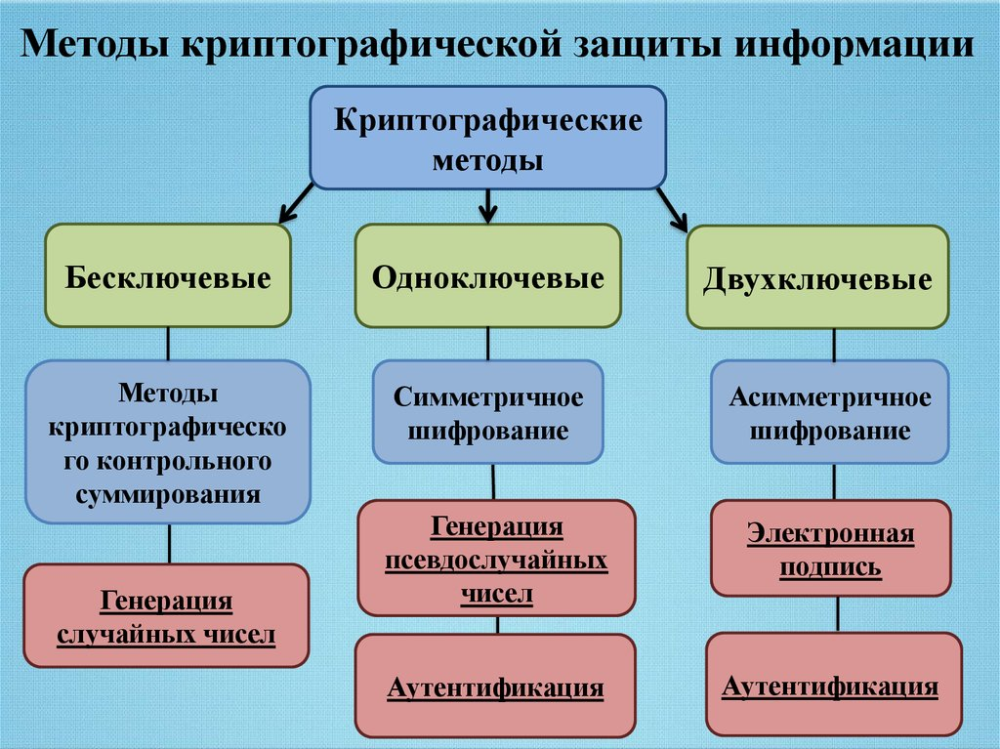

И защита информации осуществляется за счёт применения шифрования, ЭП, ключей, паролей, хэш-суммам, проверки целостности, неотрекаемости, аутентификации... И т.д. А не за счёт контроля доступа, песочницы, мониторинга, защиты канала... И других методов, относящихся к [СЗИ](#infosec).

Подробнее:

* [Контур: Что такое СКЗИ](https://ca.kontur.ru/articles/20853-chto_takoe_skzi)
* [Skillbox Media: Что такое СКЗИ и для чего нужны средства криптографической защиты](https://skillbox.ru/media/code/chto-takoe-skzi-i-dlya-chego-nuzhny-sredstva-kriptograficheskoy-zashchity/)
* [Академия Selectel: Криптографические средства защиты информации](https://selectel.ru/blog/cryptographic-protecting-information/)

## Средства Защиты Информации {#infosec}

Под данной формулировкой скрывается широкий спектр различных средств, используемых для обеспечения защиты информации от несанкционированного доступа, утечки, потери, воздействия вредоносного ПО...

Под СЗИ подпадают:

* Антивирусы &mdash; обнаружение и нейтрализация вредоносного ПО.
* Межсетевые экраны &mdash; фильтрация проходящего трафика согласно прописанным правилам. Функции глубокого анализа трафика на лету. Могут выступать в качестве сервера VPN, принимающего соединения от клиентов, для защищённого доступа в корпоративную сеть.
* Защита от несанкционированного доступа (НСД), мандатного контроля доступа &mdash; проверка подлинности устройств. Контроль за действиями пользователя или ПО выполняемого на АРМ, чтобы они не выходили за рамки нормы. Контроль подключаемых устройств.
* Доверенная загрузка &mdash; ПО или аппаратные модули, обеспечивающие контроль целостности ОС, файлов загрузки и ограничивают загрузку с внешних носителей.
* Сканеры уязвимостей &mdash; ПО для сканирования инфраструктуры на наличие незакрытых известных уязвимостей, применяемых вредоносным ПО для проникновения в инфраструктуру или распространения по сети.
* Защита от утечек информации (DLP) &mdash; программы для распознавания открытой и конфиденциальной информации. Осуществляют мониторинг потоков информации на предмет присутствия информации, которая не должна попасть во внешнюю среду.
* Мониторинг и управление событиями (SIEM) &mdash; программное обеспечение, которое собирает информацию о происходящих событиях с устройств или ПО расположенного в инфраструктуре, анализирует её и выявляют "аномалии" и иные подозрительные действия. Чтобы затем проинформировать ответственный отдел для проверки.

В части СЗИ, если оно осуществляет анализ трафика, то оно может так же выполнять попытки [HTTPS MiTM](#mitm)

Подробнее:

* [Академия Selectel: Что такое средства защиты информации](https://selectel.ru/blog/information-security-tools/)

## Ключ Электронной Подписи (ЭП) {#private-key}

Ключ, используемый для создания Электронной Подписи.

В терминах инфраструктуры открытых ключей (PKI) = приватный (англ. private) или закрытый ключ.

В рамках ассиметричного шифрования, закрытая часть ключа, с помощью которой зашифровывается сообщение для последующей проверки его действительности получателем, с помощью открытого ключа.

См. [Ассиметричное шифрование](#asymmetric-encryption)

### Контейнер ключа Электронной Подписи (ЭП) (закрытого ключа) {#key-container}

Набор файлов, являющихся защищённым представлением ключа ЭП на диске или другом носителе. Включающим как сам ключ ЭП, так и метаданные относящиеся к нему, такие как расширения использования или приложенный в контейнер сертификат ключа проверки ЭП.

 


В случае файлового представления контейнера ключа на диске или в реестре, содержимое ключа ЭП так же защищено [симметричным шифрованием](#symmetric-encryption) в лице пароля, необходимого для доступа к содержимому ключа. На смарт-карте этого не требуется, т.к. там используется пин-код.

## Ключ проверки Электронной Подписи или ключ обмена {#public-key}

Ключ используемый для проверки действительности Электронной Подписи.

В терминах инфраструктуры открытых ключей (PKI) = публичный (англ. public) или открытый ключ.

В рамках ассиметричного шифрования, открытая часть ключа, с помощью которой расшифровывается зашифрованное закрытым ключом сообщение. Благодаря чему можно убедиться, что сообщение было отправлено лицом, передавшим вам открытый ключ.

См. [Ассиметричное шифрование](#asymmetric-encryption)

Это не тоже самое, что [сертификат](#certificate). Сертификат **содержит** ключ проверки ЭП, но так же содержит в себе и дополнительные данные, заверенные ЭП УЦ. В некоторых случаях, сертификат может и вовсе не быть выпущен, только пара ключей.

## Симметричное шифрование {#symmetric-encryption}

Операция, с помощью которой сообщение, которое необходимо конфиденциально передать, подвергается изменению с использованием алгоритма с применением ключа, превращая его шифрограмму.

С точки зрения лиц, у которых нет ключа (пароля) шифрования, шифрограмма будет нечитаемой и сродни информационному мусору, даже если они знают, что этот набор данных является шифрограммой.

Лица, имеющие ключ шифрования, могут применить обратную операцию, расшифровки, для получения исходного сообщения.

Симметричной эта операция зовётся, потому что для шифровки и расшифровки применяется один и тот же ключ (пароль).

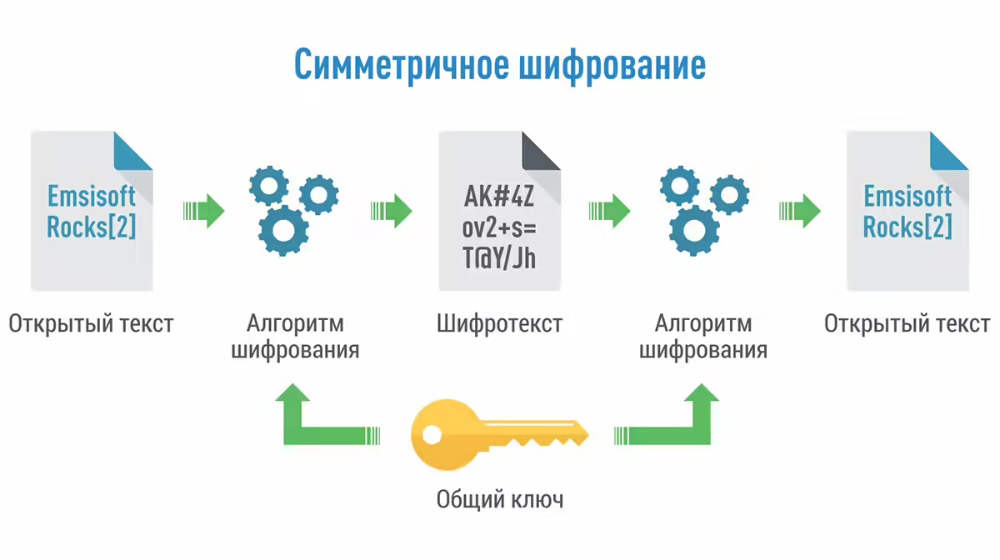

Самый простой пример, доступный в наше время, зашифрованный архив. Отправитель добавляет информацию в архив и задаёт на него пароль. Архив передаёт вам по одному каналу связи, по другому направляет пароль.

Для получения содержимого архива вы используете тот же самый пароль, который отправитель использовал для его создания. Если архив **и** пароль получит постороннее лицо, оно тоже может получить изначальное содержимое. Архив без пароля же для постороннего лица окажется нечитаемым.

Преимуществами этого вида шифрования считаются скорость, возможность работы с потоковыми данными, с большим объёмом данных.

Недостатками считается как раз таки один ключ (пароль) от всего. Все яйца в одной корзине. При передаче его через средства связи, нужно обеспечивать дополнительные меры безопасности. Если злоумышленник узнает ключ (пароль), то все данные можно считать скомпрометированными.

Подробнее:

* [Журнал Код: Симметричное шифрование](https://thecode.media/symmetric/)
* [Энциклопедия Касперского: Симметричное шифрование](https://encyclopedia.kaspersky.ru/glossary/symmetric-encryption/)
* [Симметричное и ассиметричное шифрование: просто о сложном](https://otus.ru/nest/post/726/)

## Ассиметричное шифрование {#asymmetric-encryption}

Операция шифрования, выполняемая с помощью двухключевой системы.

Некий алгоритм формирует 2 ключа (2 пароля, если хотите). Эти 2 ключа взаимосвязаны таким образом, что зашифровав сообщение одним ключом, расшифровать его можно только вторым. Это односторонняя операция.

_Никто не запрещает собирать фарш обратно в кусок мяса, по клеточкам. Но на практике, это считается невозможным, если не чрезмерно сложным. В таком смысле "односторонняя"._

Один из ключей объявляется открытым или публичным. Второй ключ объявляется закрытым или приватным, и хранится в секрете, за семью печатями. Открытую часть ключа можно свободно передавать и даже выкладывать в интернет, для того она и "открытая".

Сообщение, зашифрованное закрытым ключом, является подписью. Шифрограмму может расшифровать любое лицо с открытым ключом, а открытый ключ находиться в открытом доступе. Сам факт того, что расшифровка сообщения произошла успешно, подтверждает его целостность и неизменность, с момента публикования.

Некоторые алгоритмы поддерживают только такой режим работы, как например, DSA (который устарел). Но чаще всего, ассиметричные алгоритмы допускают менять их местами.

Сообщение, зашифрованное открытым ключом, является шифрограммой, предназначенной для лица, у которого есть соответствующий закрытый ключ. И только это лицо сможет её прочитать. Т.к. закрытый ключ считается конфиденциальным. Тем самым, можно обеспечить доставку сообщения, которое сможет прочитать только 1 получатель.

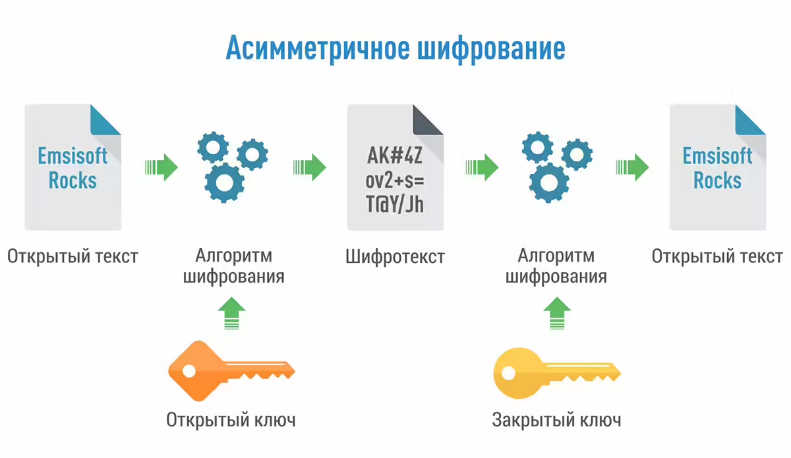

Если злоумышленник получит доступ к закрытому ключу, он сможет не только расшифровывать шифрограммы, предназначенные для владельца ключа, но и подписывать сообщения/документы от его имени. И подпись от оригинала будет не отличима. Это не тоже самое, что научиться рисовать чужую подпись, где требуются определённые навыки и может помочь графологическая экспертиза под микроскопом.

Преимуществами ассиметричного шифрования считается повышенная безопасность, т.к. двухключевая система позволяет обмениваться защищёнными сообщениями или подтверждать их подлинность без передачи закрытых (приватных) ключей кому-либо.

Недостатком же считается низкая скорость подобной операции, т.к. сам алгоритм сложнее и размеры ключей могут быть значительно большими, чем при симметричном подходе.

### Гибридное шифрование {#hybrid-encryption}

Но эти недостатки обходятся за счёт применения "гибридного шифрования" &mdash; сочетания ассиметричного, симметричного шифрования и хэш-сумм.

Например, вместо того, чтобы весь документ, который требуется подписать, превращать в шифрограмму, "подписывается" только [хэш-сумма](#hash) этого документа. А при попытке безопасно передать большой объём данных, то эти данные шифруются с помощью [симметричного шифрования](#symmetric-encryption), а в шифрограмму, созданную с помощью открытого ключа, прикладывается ключ (пароль) от блока симметрично зашифрованных данных (ключ сможет расшифровать только получатель с соответствующим закрытым ключом).


Подробнее:

* [Журнал Код: Асимметричное шифрование](https://thecode.media/asymmetric/)
* [Журнал Код: Объяснение асимметричного шифрования без математики](https://thecode.media/no-digit-code/)
* [Энциклопедия Касперского: Асимметричное шифрование](https://encyclopedia.kaspersky.ru/glossary/asymmetric-encryption/)
* [Симметричное и ассиметричное шифрование: просто о сложном](https://otus.ru/nest/post/726/)
* [IntSystem.org: Асимметричное шифрование. Как это работает?](https://intsystem.org/security/asymmetric-encryption-how-it-work/)

## Кодирование {#encoding}

<!-- Не уверен, зачем я написал этот блок, но пусть будет. Будем считать, что просто захотелось. -->

Это процесс преобразования информации из одной формы в другую, более удобную для хранения, передачи или обработки.

В зависимости от контекста, кодирование можно рассматривать, как попытку представить определённый тип информации в качестве нулей и единиц, которые компьютер способен понять и сохранить. Так же как текст, в компьютере, обычно хранится не как текст, а как набор строго определённых стандартом байтов. В зависимости от используемой кодировки. Как например, слово "hello" на компьютере будет записано в виде `01101000 01100101 01101100 01101100 01101111`, согласно [таблице ASCII](https://snipp.ru/handbk/table-ascii).

Но мы тут будем рассматривать контекст преобразования информации из одного вида в другой, более подходящий, например, для передачи через определённые каналы связи.

Предположим, для примера, нам нужно передать через электронную почту вложение, в виде бинарного (не текстового) файла. Но ваш клиент электронной почты не поддерживает вложения, он может передавать только текст.

Если вставить содержимое бинарного файла в текстовое поле почтового клиента, у вас, скорее всего, на его месте отобразится абракадабра:

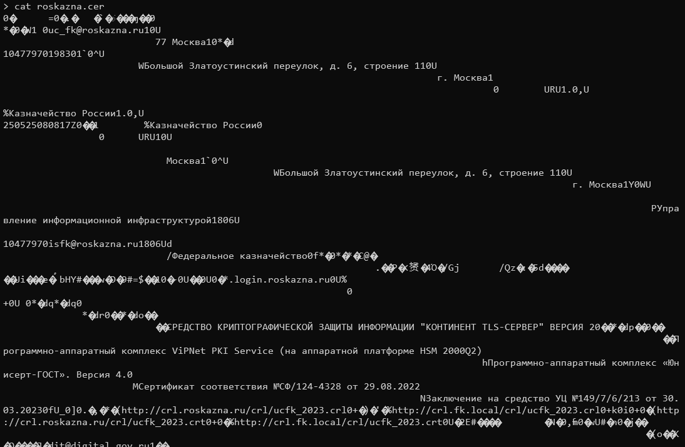

А при копировании обратно в файл на машине получателя, файл оказывается повреждённым. Потому что скопировать в буфер обмена в неизменном виде файл не получается.

Для таких случаев, придуман, например, формат [base64](https://руни.рф/Base64). Кодировщик берёт на вход любые данные и преобразовывает их в текстовый блок, который можно вставить прямо в сообщение электронной почты. Этот блок так же иногда называется `ASCII Armor`.

<!-- У меня под рукой не оказалось никакого другого примера бинарных данных... Тем более, очень короткого. Чтоб несколько килобайт, не больше. -->

??? note "Вывод команды `cat roskazna.cer | base64` (под спойлером)"

    ```text
    > cat roskazna.cer | base64

    MIIJPTCCCOqgAwIBAgIQLr0JvGAEzN2BvbTWybHvyzAKBggqhQMHAQEDAjCCAVcxIDAeBgkqhkiG
    9w0BCQEWEXVjX2ZrQHJvc2them5hLnJ1MRgwFgYDVQQIDA83NyDQnNC+0YHQutCy0LAxFTATBgUq
    hQNkBBIKNzcxMDU2ODc2MDEYMBYGBSqFA2QBEg0xMDQ3Nzk3MDE5ODMwMWAwXgYDVQQJDFfQkdC+
    0LvRjNGI0L7QuSDQl9C70LDRgtC+0YPRgdGC0LjQvdGB0LrQuNC5INC/0LXRgNC10YPQu9C+0Los
    INC0LiA2LCDRgdGC0YDQvtC10L3QuNC1IDExGTAXBgNVBAcMENCzLiDQnNC+0YHQutCy0LAxCzAJ
    BgNVBAYTAlJVMS4wLAYDVQQKDCXQmtCw0LfQvdCw0YfQtdC50YHRgtCy0L4g0KDQvtGB0YHQuNC4
    MS4wLAYDVQQDDCXQmtCw0LfQvdCw0YfQtdC50YHRgtCy0L4g0KDQvtGB0YHQuNC4MB4XDTI0MDMw
    MTA4MDgxN1oXDTI1MDUyNTA4MDgxN1owggGrMQswCQYDVQQGEwJSVTEVMBMGA1UECAwM0JzQvtGB
    0LrQstCwMWAwXgYDVQQJDFfQkdC+0LvRjNGI0L7QuSDQl9C70LDRgtC+0YPRgdGC0LjQvdGB0LrQ
    uNC5INC/0LXRgNC10YPQu9C+0LosINC0LiA2LCDRgdGC0YDQvtC10L3QuNC1IDExGTAXBgNVBAcM
    ENCzLiDQnNC+0YHQutCy0LAxWTBXBgNVBAsMUNCj0L/RgNCw0LLQu9C10L3QuNC1INC40L3RhNC+
    0YDQvNCw0YbQuNC+0L3QvdC+0Lkg0LjQvdGE0YDQsNGB0YLRgNGD0LrRgtGD0YDQvtC5MTgwNgYD
    VQQKDC/QpNC10LTQtdGA0LDQu9GM0L3QvtC1INC60LDQt9C90LDRh9C10LnRgdGC0LLQvjEYMBYG
    BSqFA2QBEg0xMDQ3Nzk3MDE5ODMwMR8wHQYJKoZIhvcNAQkBFhBpc2ZrQHJvc2them5hLnJ1MTgw
    NgYDVQQDDC/QpNC10LTQtdGA0LDQu9GM0L3QvtC1INC60LDQt9C90LDRh9C10LnRgdGC0LLQvjBm
    MB8GCCqFAwcBAQEBMBMGByqFAwICJAAGCCqFAwcBAQICA0MABEAQFLQMAi6Pu1CHPOi1n6w0zoyh
    L0dqCS9ReqQ6uzVkqr+a5bcK5/xVad7tAYdl6diZYkhZI43j+XfoRNs5Iz0ko4IFMTCCBS0wDgYD
    VR0PAQH/BAQDAgTwMB4GA1UdEQQXMBWCEyoubG9naW4ucm9za2F6bmEucnUwEwYDVR0lBAwwCgYI
    KwYBBQUHAwEwHQYDVR0gBBYwFDAIBgYqhQNkcQEwCAYGKoUDZHECMAwGBSqFA2RyBAMCAQAwgZcG
    BSqFA2RvBIGNDIGK0KHQoNCV0JTQodCi0JLQniDQmtCg0JjQn9Ci0J7Qk9Cg0JDQpNCY0KfQldCh
    0JrQntCZINCX0JDQqdCY0KLQqyDQmNCd0KTQntCg0JzQkNCm0JjQmCAi0JrQntCd0KLQmNCd0JXQ
    ndCiIFRMUy3QodCV0KDQktCV0KAiINCS0JXQoNCh0JjQryAyMIIBogYFKoUDZHAEggGXMIIBkwyB
    h9Cf0YDQvtCz0YDQsNC80LzQvdC+LdCw0L/Qv9Cw0YDQsNGC0L3Ri9C5INC60L7QvNC/0LvQtdC6
    0YEgVmlQTmV0IFBLSSBTZXJ2aWNlICjQvdCwINCw0L/Qv9Cw0YDQsNGC0L3QvtC5INC/0LvQsNGC
    0YTQvtGA0LzQtSBIU00gMjAwMFEyKQxo0J/RgNC+0LPRgNCw0LzQvNC90L4t0LDQv9C/0LDRgNCw
    0YLQvdGL0Lkg0LrQvtC80L/Qu9C10LrRgSDCq9Cu0L3QuNGB0LXRgNGCLdCT0J7QodCiwrsuINCS
    0LXRgNGB0LjRjyA0LjAMTUPQtdGA0YLQuNGE0LjQutCw0YIg0YHQvtC+0YLQstC10YLRgdGC0LLQ
    uNGPIOKEltCh0KQvMTI0LTQzMjgg0L7RgiAyOS4wOC4yMDIyDE7Ql9Cw0LrQu9GO0YfQtdC90LjQ
    tSDQvdCwINGB0YDQtdC00YHRgtCy0L4g0KPQpiDihJYxNDkvNy82LzIxMyDQvtGCIDMwLjAzLjIw
    MjMwZgYDVR0fBF8wXTAuoCygKoYoaHR0cDovL2NybC5yb3NrYXpuYS5ydS9jcmwvdWNma18yMDIz
    LmNybDAroCmgJ4YlaHR0cDovL2NybC5may5sb2NhbC9jcmwvdWNma18yMDIzLmNybDB3BggrBgEF
    BQcBAQRrMGkwNAYIKwYBBQUHMAKGKGh0dHA6Ly9jcmwucm9za2F6bmEucnUvY3JsL3VjZmtfMjAy
    My5jcnQwMQYIKwYBBQUHMAKGJWh0dHA6Ly9jcmwuZmsubG9jYWwvY3JsL3VjZmtfMjAyMy5jcnQw
    HQYDVR0OBBYEFMAyRSOIr6iODgnvvhROBtcwLMqpMIIBdwYDVR0jBIIBbjCCAWqAFKcLlShvn+RL
    ilGAsoUfiUr85/CcoYIBQ6SCAT8wggE7MSEwHwYJKoZIhvcNAQkBFhJkaXRAZGlnaXRhbC5nb3Yu
    cnUxCzAJBgNVBAYTAlJVMRgwFgYDVQQIDA83NyDQnNC+0YHQutCy0LAxGTAXBgNVBAcMENCzLiDQ
    nNC+0YHQutCy0LAxUzBRBgNVBAkMStCf0YDQtdGB0L3QtdC90YHQutCw0Y8g0L3QsNCx0LXRgNC1
    0LbQvdCw0Y8sINC00L7QvCAxMCwg0YHRgtGA0L7QtdC90LjQtSAyMSYwJAYDVQQKDB3QnNC40L3R
    htC40YTRgNGLINCg0L7RgdGB0LjQuDEYMBYGBSqFA2QBEg0xMDQ3NzAyMDI2NzAxMRUwEwYFKoUD
    ZAQSCjc3MTA0NzQzNzUxJjAkBgNVBAMMHdCc0LjQvdGG0LjRhNGA0Ysg0KDQvtGB0YHQuNC4ggsA
    8KniiQAAAAAHnjAKBggqhQMHAQEDAgNBAFn7Yzw6POAC+IdnN/jDu+Ob3DfOE+ba0rOmuRBzDO2c
    6jmWAN5pRamIONHDGSOsdU7fIl40qfr/uJ9j7HWAFEA=
    ```

Теперь, этот текстовый блок можно вставить в сообщение в любом месте. Прямо в текст. И теперь, получатель этого электронного сообщения, может скопировать блок уже со своей стороны, в программу:

``` { .bash .annotate }
base64 -d > roskazna.cer # (1)
```

1. приписка `> roskazna.cer`, указывает оболочке, что нужно сохранить вывод в файл

и нажать Ctrl+D, чтобы дать программе понять, что ввод окончен. На выходе будет получен неизменный файл.

Но так произойдёт только в том случае, если никто не изменил хотя бы одной буквы в текстовом блоке. Кодировщик не чувствителен к переносам строки. Не обязательно, чтобы строка была оформлена именно как аккуратный блок шириной в 80 символов. Это может быть и одна длинная строка. Но если изменить содержимое строки, ошибки не будет, до тех пор, пока символ находится в пределах формата (если буква была изменена не с латинской на латинскую, а на кириллическую, например). И файл не будет восстановлен в изначальном виде.

Важно помнить, что:

1. **Кодирование не является шифрованием в каком-либо виде** и не обеспечивает безопасность кодируемых данных от изменения. Это просто изменение представления информации.
2. Раскодировать строку может любой, кто имеет при себе программу кодировщик. Кодировка и раскодировка не требует наличие каких-либо ключей или паролей, и не скрывает изначальную информацию от чужих глаз. Только от тех, кто не знает, что такое `base64`, возможно...

К счастью, передаваемый таким образом файл уже содержит в себе электронную подпись, т.к. это просто [серверный сертификат](#server-certificate) от ресурса `sobi.login.roskazna.ru`, который лежал у меня под рукой. И в случае изменения, программа, используемая для просмотра сертификатов, сразу сообщит об этом.

??? note "А вы знали, что в электронной почте (Email)..."

    На самом деле,  все вложения к письму передаются закодированными в base64. Просто клиент электронной почты делает всё за вас. Вы можете убедиться в этом, сохранив письмо в формате `.eml` и открыв любым текстовым редактором. Пример взят не совсем с потолка. 🙃

### base64 в Windows {#base64-win}

Утилита `base64` в Windows отсутствует по умолчанию. Для кодирования в формат base64 можно использовать PowerShell.

Для кодирования:

```powershell
[Convert]::ToBase64String((Get-Content -Path "roskazna.cer" -Encoding Byte))
```

Для декодирования:

```powershell
[System.Text.Encoding]::UTF8.GetString([System.Convert]::FromBase64String((Get-Content -Path "encoded.txt" -Encoding UTF8)))
```

Или [скачать](https://www.di-mgt.com.au/base64-for-windows.html) её из интернета и установить в место, определённом переменной окружения `PATH`.

Так же существуют [онлайн-кодировщики](https://www.base64decode.org/ru/) в большом количестве в интернете. Часть из которых работают за счёт чистого JavaScript и данные не покидают браузер.

## Хэширование, хэш-сумма, контрольная сумма {#hash}

Хэширование — это процесс преобразования произвольных данных (например, текста, файла или пароля) в фиксированную строку символов определенной длины, которая называется хешем или хэш-суммой. Хэш-суммы обычно используют для проверки целостности данных и аутентификации пользователей.

Свойствами хэш-суммы является:

* **Детерминированность**: Один и тот же вход всегда даёт одинаковый выход. То есть, если применить хэш-функцию к одному и тому же сообщению (тексту, файлу) дважды, результат будет идентичным.
* **Односторонняя функция**: Легко получить хэш из исходных данных, но практически невозможно восстановить исходные данные из хэша. Даже зная хэш, нельзя точно сказать, какие именно данные использовались для его создания.

   _Я повторюсь, но принцип односторонности в случае хэш-суммы такой, что никто не запрещает собирать фарш обратно в кусок мяса. Но на практике, это считается невозможным, если не чрезмерно сложным. И даже хуже, т.к. вы не видели, какой конкретно кусок мяса был отправлен в мясорубку, вы не можете точно сказать, мясо какого животного было использовано для его изготовления. И из всего цельного большого куска мяса, у вас фарша объёмом с его маленькую часть..._

* **Устойчивость к коллизиям**: Хэш-функции создаются таким образом, что вероятность того, что разные данные дадут одинаковую хэш-сумму, крайне мала. И чем больше хэш-сумма в битах, тем меньше такая вероятность. В теории, коллизии всё ещё возможны, но требуют больших вычислительных ресурсов для того, чтобы создать подложный файл с полезной нагрузкой, **соответствующим размером** и который не будет выглядеть подозрительно.

На примере, у нас есть вот такой текст:

```text
Раз, два, три, четыре, пять,
Вышел зайчик погулять.
Вдруг охотник выбегает,
Прямо в зайчика стреляет,
Но охотник не попал,
Серый зайчик убежал.
```

Если сохранить его в текстовый файл `текст.txt`, то SHA1 хэш-сумма файла будет:

```text
$ sha1sum текст.txt
645c9bb64737e7935fd4d9ac02e431baf6a86c7f  текст.txt
```

??? note "Если вы используете Windows"

    В кодировке UTF-8 и окончаниями строк CRLF, принятыми в Windows. Это важно. Если сохранить с окончаниями строк формата LF, то хэш-сумма будет другой: `47303f4caa0d447f84891d16d2e762a75bfc3b0e`.

Есть поменять буквально один символ, например, в первой строке, в слове `три` заменим `и` на `э`.

`Раз, два, трэ, четыре, пять,`

То она станет уже сильно другой:

```text
$ sha1sum текст.txt
44e1766d0d607c0d97cfc5f250e16ca19192ce3c  текст.txt
```

Вернуть букву `и` на место, и она снова станет как прежде:

```text
$ sha1sum текст.txt
645c9bb64737e7935fd4d9ac02e431baf6a86c7f  текст.txt
```

Допустим, мы отправили этот файл знакомому по электронной почте и он хочет проверить, дошёл ли он в целостности. Чтобы это сделать, достаточно отправить ему строку `645c9bb64737e7935fd4d9ac02e431baf6a86c7f`, название хэш-функции (SHA1) и что размер файла 260 байт (необязательно, но это дополнительный фактор. И желательно именно в точности до **байтов**). Если на его компьютере результат выполнения хэш-суммы и размер совпадёт, значит, файл не был изменён по дороге злоумышленником и он дошёл в изначальном виде.

SHA1 была использована для примера, т.к. это до сих пор один из самых распространённых способов хэширования, не смотря на то, что уже признан не очень надёжным.

В электронном документообороте в России принято использовать исключительно хэш-сумму по ГОСТу, которую можно создать с помощью программы [cpverify](https://www.cryptopro.ru/faq/how-to-checksum).

Если у вас нет утилиты `sha1sum` или у вас ОС Windows, вы можете получить хэш-сумму файла с помощью [7-Zip](https://7-zip.org/) или [Hashcheck](https://github.com/gurnec/HashCheck). Или, в командной строке, с помощью [PowerShell](https://learn.microsoft.com/en-us/powershell/module/microsoft.powershell.utility/get-filehash?view=powershell-5.1) и [certutil](https://remontka.pro/get-file-hash-windows-powershell/).

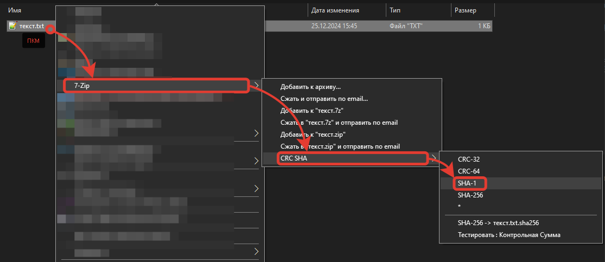


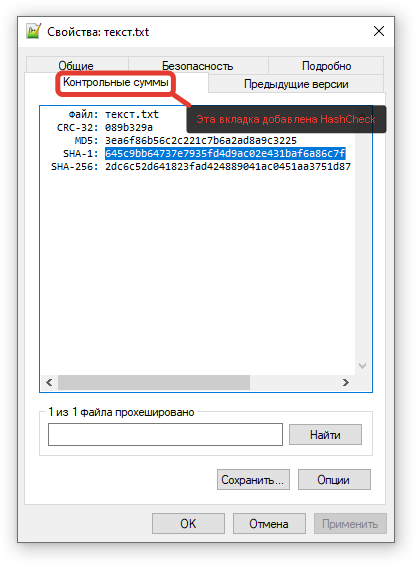

Подробнее:

* [Skillfactory Media: Хэширование](https://blog.skillfactory.ru/glossary/heshirovanie/)
* [Энциклопедия Касперского: Хэш](https://encyclopedia.kaspersky.ru/glossary/hash/)
* [OTUS: Алгоритм хеширования данных: просто о сложном](https://otus.ru/nest/post/1835/)

## Электронная Подпись {#sign}

Шифрограмма, созданная с использованием закрытого (приватного) ключа по принципу [Ассиметричного шифрования](#asymmetric-encryption). Успешная расшифровка данной шифрограммы открытым ключом подтверждает 2 вещи:

1. Что она была создана лицом, владеющим соответствующим открытому закрытым ключом.
2. Целостность подписи не была нарушена с момента подписания.

В зависимости от цели создания ЭП, шифрограмма может содержать различную информацию для удостоверения. Как в самой шифрограмме, так и прикреплённую к ней для информации.

В случае подписания файла-документа при использовании КЭП, информация в ЭП обычно содержит следующее:

1. [Хэш-сумма](#hash) подписанного файла-документа. При совпадении хэш-суммы проверяемого файла с хэш-суммой указанной в шифрограмме, проверяется целостность (неизменность) подписанного файла с момента подписания.
2. [Сертификат](#certificate) лица, осуществившего ЭП. Для удостоверения подписанта, ключа проверки ЭП и действительности его сертификата. В том числе, возможна проверка его на отзыв со стороны проверяющего ЭП.

Эту информацию содержит т.н. "базовая" подпись.

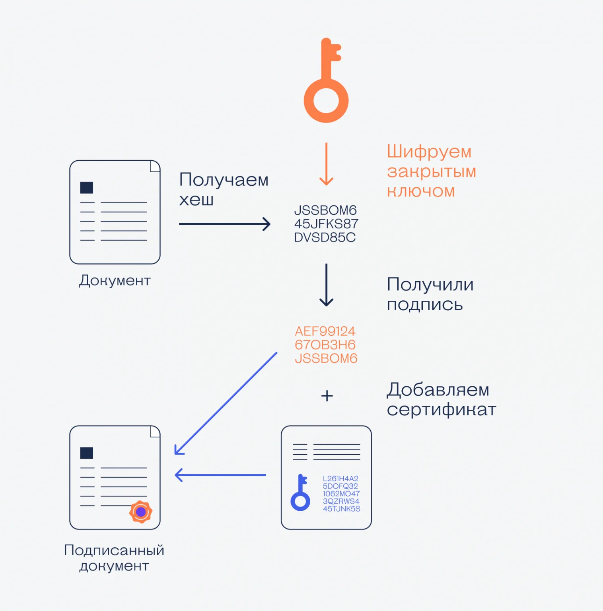


В расширенном варианте, ЭП может так же содержать:

* Информацию, полученную с [сервера доверенного времени](#trusted-timestamp), заверенную ключом ЭП Доверенной Третьей Стороны (владельца аккредитованного сервера доверенного времени), о времени осуществления подписи документа и сертификат с ключом проверки ЭП ДТС.
* Полную цепочку сертификации, до корневого сертификата.
* Информацию о проверке отзыва на момент подписания.
* Другие метаданные.

Подробнее:

* [Журнал Код: Что такое электронная подпись и как она работает](https://thecode.media/crypto/)
* [CAdES &&mdash; Руниверсалис](https://руни.рф/CAdES)
* [Как создать и проверить подпись встроенными средствами КриптоПро в лице Инструментов КриптоПро](https://support.cryptopro.ru/index.php?/Knowledgebase/Article/View/398/0/sozdnie-i-proverk-otsoedinennojj-podpisi-v-instrumenty-kriptopro)
* [Метка доверенного времени, штамп времени](#trusted-timestamp)
* [Срок действия подписи с проставленной МДВ и без](#trusted-timestamp-sign-validity)

### Электронно Цифровая Подпись (ЭЦП) {#ecp-deprecated}

Тоже самое, что и [Электронная Подпись](#sign), только это устаревшая формулировка. Нежелательная к применению.

В то же время, существует комплекс для осуществления ЭП в браузере &mdash; КриптоПро ЭЦП, который после устаревания термина, название не сменил.

### Встроенная ЭП {#sign-builtin}

ЭП выполненная с использованием встроенных в формат документа средств для осуществления ЭП. Некоторые форматы документов, такие как Word, Excel и PDF, поддерживают встроенное в сам формат подписание документов.

Из преимуществ такой ЭП, это хранение как самого документа, так и ЭП, внутри документа. Без внешних файлов. И проверка ЭП встроенными в программы для просмотра или редактирования средствами такой ЭП.

Из недостатков, в рамках ГОСТ-криптографии и КЭП, если программа изначально не поддерживала ГОСТ-алгоритмы и применение криптопровайдеров, то потребуется наличие внешних-программ расширений, как для осуществления такой подписи, так и для проверки.

Например, для Word и Excel, у всех участников ЭДО с применением встроенной подписи, потребуется установка и лицензии на ПО [КриптоПро Office Signature](https://www.cryptopro.ru/products/office/signature) (или аналогичное ПО от других поставщиков ГОСТ-криптопровайдеров).

Для PDF, аналогично, установка и лицензии на ПО [КриптоПро PDF](https://www.cryptopro.ru/products/other/pdf) совместно с Adobe Reader (обычная бесплатная версия тоже подойдёт).

Как вариант, [Р7-Офис](https://support.r7-office.ru/desktop_editors/documens/digital-signature/use_ds/) заявляет о поддержке ЭП документов с помощью КриптоПро CSP.

В качестве альтернативы связки КриптоПро PDF + Adobe Reader, можно использовать [Окуляр ГОСТ](https://okulargost.ru/). Который является "форком" программы для просмотра PDF из [состава KDE](https://okular.kde.org/ru/). И который, пока ещё является [свободным ПО](https://gitlab.com/lab50/okular-csp/okular) (и, будем надеяться, таким и останется, т.к. на сайте информации об этом репозитории нет. А зачем прятать?).

Подробнее:

* [Контур: Электронная подпись: открепленная, присоединенная и встроенная](https://ca.kontur.ru/articles/ecp-terminy)
* [Контур: Как подписать документ электронной подписью? Виды подписей и программное обеспечение.](https://ca.kontur.ru/faq/kak-podpisat-dokument?ysclid=m5pkvhb5dr342094141)

### Присоединенная ЭП {#sign-joined}

Файл с расширением `.sig`, `.sgn`, `.p7s`.

ЭП в формате, который включает как и саму ЭП, так и непосредственно файл, который был подписан. Обычно присоединенную подпись можно отличить по наличию только одного такого файла с (чуть больше) размером цельного документа. Или, если сразу после создания такой ЭП вами, будет создан файл с указанным расширением в качестве суффикса, с размером чуть более чем сам подписанный документ.

Процесс создания присоединенной ЭП можно сравнить с запечатанным конвертом, внутри которого лежит документ с подписанными данными. Этот файл можно копировать, пересылать по почте, хранить на диске...

Но нужно учесть, что без криптографических программ с поддержкой конкретно этого формата подписи, невозможно прочитать содержимое подписанного файла, как и проверить ЭП или получить исходный файл. Точно так же, как нельзя извлечь содержимое конверта, не вскрыв его. С одним отличием, что для вскрытия конверта, понадобится инструмент.

Формат используемого документа или используемое ПО для его просмотра и редактирования, не ограничены. Документ просто помещается с подписью в единый контейнер, как в архив.

Некоторые форматы поддерживают сжатие содержимого "конверта", аналогично программам архивации.

Подробнее:

* [Контур: Электронная подпись: открепленная, присоединенная и встроенная](https://ca.kontur.ru/articles/ecp-terminy)
* [Контур: Как подписать документ электронной подписью? Виды подписей и программное обеспечение.](https://ca.kontur.ru/faq/kak-podpisat-dokument?ysclid=m5pkvhb5dr342094141)

### Отсоединенная ЭП {#sign-external}

Файл с расширением `.sig`, `.sgn`, `.p7s`.

ЭП выполненная в формате отдельного файла, обычно, распространяемого совместно с подписанным файлом, имеющим такое же название (вместе с расширением файла) и суффикс-расширение `.p7s`, `.sig`, `.sgn`. Размер файла обычно составляет около 3-5 килобайт. Больше, если подписантов более чем один или используется расширенная подпись с [меткой доверенного времени](#trusted-timestamp), т.к. это потребует прикрепить так же сертификат доверенного третьего лица, подписавшего метку времени.

Для действительности подписи и отсутствия проблем при её проверки, имя файла, как документа, так и подписи, изменять нежелательно. Потому следует подумать об имени файла до подписания, если это важно. Подпись действительна, если файлы распространяются вместе. Допустимо положить исходный подписанный документ и откреплённую подпись в один архивный файл, создав подобие присоединённой ЭП, только не требующей наличия криптографического ПО для вскрытия "конверта", только для проверки ЭП.

Если формат файла подразумевает редактирование его в той же программе, что используется для просмотра, то при наличии такой возможности, рекомендуется запретить внесение изменений в документ. Например, документ `.docx` можно [пометить как окончательный](https://support.microsoft.com/ru-ru/office/защита-окончательной-версии-файла-от-изменений-b1af610f-f172-42c9-85fc-a178a503cc81), что защитит от случайного изменения. Если использовать PDF, например, его обычно нельзя редактировать без специальных программ (Adobe Reader Pro, PDF X-Change). Потому, этот формат лучше подходит, если внесение изменений в документ далее не подразумевается. И прочитать документ не составит труда, т.к. существует большое количество бесплатного ПО для просмотра PDF, включая браузер...

Подробнее:

* [Контур: Электронная подпись: открепленная, присоединенная и встроенная](https://ca.kontur.ru/articles/ecp-terminy)
* [Контур: Как подписать документ электронной подписью? Виды подписей и программное обеспечение.](https://ca.kontur.ru/faq/kak-podpisat-dokument?ysclid=m5pkvhb5dr342094141)

### Штамп ЭП в документе {#sign-stamp}

Отметка, проставляемая в подписанном документе, информирующая о том, что тот подписан ЭП, а не собственноручно.

Оформляется согласно ГОСТ Р `7.0.97-2016` и должен содержать следующую информацию:

* Формулировка &laquo;Документ подписан электронной подписью&raquo;
* Серийный номер сертификата с ключом проверки ЭП
* ФИО владельца сертификата
* Срок действия сертификата

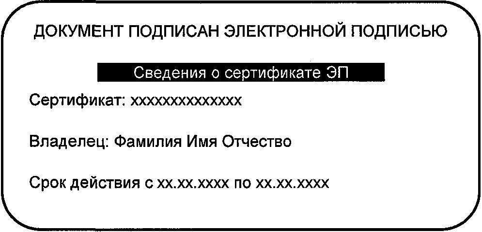

Сам формат, шрифт, расположение указанных данных может разниться. Может быть так же добавлен логотип организации или герб ведомства...

Для коммерческих организаций не является обязательным.

Наличие штампа не является подписанием документа соответствующей ЭП, а только способом информирования об этом факте. ЭП должна быть приложена к документу, чтобы подпись была действительной. Нет приложенной подписи выполненной с помощью СКЗИ, выполненной с помощью ключа ЭП от сертификата, указанного в штампе &mdash; подпись действительной не является.

Подробнее:

* [Контур: Как поставить штамп электронной подписи на документе](https://ca.kontur.ru/articles/53845-kak_postavit_shtamp_elektronnoj_podpisi_na_dokumente)

## Сертификат {#certificate}

Это ключ проверки ЭП, упакованный в специальный формат, к которому приложена информация о том, кому сертификат выдан и для чего предназначается. Сертификат, подписывается УЦ, выдавшим, тем самым заверяя ту информацию, что в нём содержится.

Обычно хранится в бинарном формате DER (расширения файла: `.cer`, `.crt`, `.der`). Но так же есть и другие форматы. Подразумевающие хранение в качестве текстового файла, где бинарная информация [кодирована](#encoding) с помощью base64. Например, `.pem`.

Сертификат открытого ключа обмена и сертификат ключа проверки ЭП представляет собой структурированную двоичную запись в формате ASN.1, содержащую:

* Имя субъекта или объекта системы, однозначно идентифицирующее его в системе.
* Ключ проверки ЭП субъекта или объекта системы.
* Дополнительные атрибуты, определяемые требованиями использования сертификата в системе. Например, допустимые применения сертификата. Информация о криптопровайдере, использованном для выпуска сертификата. Срок действия закрытого ключа.
* ЭП Издателя (Удостоверяющего центра), заверяющую совокупность этих данных.

Сертификат может быть как подписанным УЦ, так и самоподписанным. Самоподписанным сертификат считается, если Субъект <abbr title="равен">=</abbr> Издателю, и сертификат заверен соответствующим открытому, указанному в сертификате, закрытым ключом.

В случае же подписания сертификата удостоверяющим центром, то УЦ таким образом, своим "авторитетом" заверяет, что информация в сертификате указана верно и сертификат был выдан лицу, указанному в свойствах.

Файл сертификата на диске в Windows обычно отображается так:

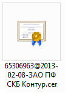

### Корневой сертификат ЦС (сертификат ГУЦ) {#root-certificate}

[Сертификат](#certificate), выпущенный организацией для использования в качестве корневого ЦС, с которого начинается строиться [путь сертификации](#certification-path).

С точки зрения [КЭП](#qualified) &mdash; это в обязательном порядке самоподписанный сертификат, выпущенный [Минцифры России](http://crl.roskazna.ru/crl/Корневой%20сертификат%20ГУЦ%202022.cer), как регулятора и аккредитационного центра для ГОСТ УЦ. Ранее, именовались как [Минкомсвязи России](https://www.cnews.ru/news/top/2020-09-11_minkomsvyazi_ofitsialno_poluchilo) и использовали другой [сертификат](http://crl.roskazna.ru/crl/Корневой%20сертификат%20ГУЦ%20ГОСТ%202012.crt), который сейчас является устаревшим и устанавливается только для проверки архивной ЭП.

С точки зрения [НЭП](#unqualified) &mdash; это может быть сертификат:

* Сертификат, выпущенный банком для применения в дистанционном банковском обслуживании.
* Сертификат, выпущенный Минцифры России в рамках [Национального Удостоверяющего Центра](https://www.gosuslugi.ru/crt) (НУЦ) для выпуска TLS сертификатов.
* ...

Так же это может быть "технический" корневой сертификат, применяемый в рамках доменной среды конкретной организации или выпущенный программой для [HTTPS MiTM](#mitm).

Корневой сертификат можно отличить по следующим факторам:

* При просмотре пути сертификации, сертификат всегда будет первым в списке.

  

* Сертификат является самоподписанным. А значит `Субъект` &equals; `Издателю`.
  
  

* В свойствах `Основных ограничений` может быть явно указано, что `Тип субъекта = ЦС`.

  

* В свойствах `Использование ключа` может быть указано, что сертификат предназначен для подписи сертификатов и [CRL](#crl).

  

Т.к. корневые сертификаты всегда самоподписанные, доверие к их подписи выстраивается только за счёт установки в хранилище корневых ЦС на компьютере.

Большинство корневых ЦС от международных центров, используемых для выпуска сертификатов для сайтов в интернете, предустановлены в ОС. В случае ГОСТ-криптографии, устанавливаются либо самостоятельно (т.к. производитель ОС Windows вне юрисдикции РФ и он не станет поставлять сам), либо вместе с соответствующим криптопровайдером (без которого они всё равно работать не будут).

### Промежуточный сертификат ЦС (сертификат УЦ) {#ca-certificate}

[Сертификат](#certificate), выпущенный для организации, для использования в качестве промежуточного ЦС. Чаще всего, именно промежуточные ЦС занимаются выпуском сертификатов для конечных пользователей или организаций. Корневые ЦС выдают сертификаты только промежуточным ЦС.

С точки зрения [КЭП](#qualified) &mdash; это в обязательном порядке сертификат, выпущенный [ГУЦ Минцифры России](#root-certification-authority), как регулятора и аккредитационного центра для ГОСТ УЦ.

В рамках [НЭП](#unqualified), может как присутствовать, так и отсутствовать в цепочке. В случае "технического" применения сертификатов, чаще отсутствует, чем присутствует. В случае международно принятых сертификатов для [TLS](#tls) в интернете, должен присутствовать.

Сертификат ЦС можно отличить по следующим факторам:

* При просмотре пути сертификации, сертификат всегда будет вторым в списке, после корневого.

  

* Не может быть самоподписанным, `Субъект` **&ne;** `Издателю`.

  

* В свойствах `Основных ограничений` может быть явно указано, что `Тип субъекта = ЦС`.

  

* В свойствах `Использование ключа` может быть указано, что сертификат предназначен для подписи сертификатов и [CRL](#crl).

  

### Личный сертификат {#personal-certificate}

[Сертификат](#certificate), выданный конечному пользователю на руки для использования в качестве ЭП или авторизации в ИС. Является конечным, т.е. последним в цепочке сертификации и не имеет права подписывать другие сертификаты для их удостоверения.

Как отличить личный сертификат:

* При просмотре пути сертификации, сертификат всегда будет последним, третьим звеном в цепочке. В некоторых случаях, если сертификат не является сертификатом [КЭП](#qualified), а сертификатом [НЭП](#unqualified) или "техническим" сертификатом, [промежуточный ЦС](#ca-certificate) может отсутствовать и тогда он будет вторым в списке.

  

* В поле `Улучшенный ключ` обязательно будет проставлено использование как `Проверка подлинности клиента` или `Аутентификация клиента`.

  

### Серверный сертификат {#server-certificate}

[Сертификат](#certificate), выданный организации для удостоверения подлинности конечного сервера, обрабатывающего запросы от клиентов через HTTPS. Как и личный, является конечным, т.е. последним в цепочке сертификации и не имеет права подписывать другие сертификаты для их удостоверения.

При подключении по протоколу HTTPS, используя [TLS](#tls) в качестве протокола защиты канала, сервер предоставляет свой сертификат, подписанный УЦ, для удостоверения подлинности сервера, к которому осуществляется подключение. Что мы действительно подключаемся к серверу Федерального казначейства, располагаемому на домене `eb.cert.roskazna.ru`, а не к злоумышленнику, перехватившему ваш запрос.

Удостоверение подлинности сервера, обычно происходит автоматически, т.к. сервер передаёт свой сертификат при инициализации соединения и сертификат проверяется как по [пути сертификации](#certification-path), так и на [отзыв](#revoke-check). Но некоторые программы, такие как Континент TLS-клиент, могут потребовать его предварительной установки, иначе будут выдавать ошибку при установке соединения.

Как отличить серверный сертификат:

* При просмотре пути сертификации, сертификат всегда будет последним, третьим звеном в цепочке. В некоторых случаях, если сертификат не является сертификатом [КЭП](#qualified), а сертификатом [НЭП](#unqualified) или "техническим" сертификатом, [промежуточный ЦС](#ca-certificate) может отсутствовать и тогда он будет вторым в списке.

  

* В поле `Улучшенный ключ` обязательно будет проставлено использование как `Проверка подлинности сервера` или `Аутентификация сервера`.

  

* Обязательно будет присутствовать поле `Дополнительное имя субъекта` с указанием доменного имени, с которым предназначается его использование. Если впереди присутствует символ звёздочки, то сертификат является wildcard-сертификатом, подходящим для любого имени с указанным после суффиксом. В случае сертификата из примера, он подойдёт как для `eb.cert.roskazna.ru`, так и для `sobi.cert.roskazna.ru`.

  

## Удостоверяющий Центр (УЦ) {#certification-authority}

Это организация, которая занимается выпуском [сертификатов](#certificate) электронной подписи и удостоверяет подлинность владельцев этих сертификатов. Удостоверяющие центры играют ключевую роль в обеспечении безопасности и надежности использования электронных подписей.

В терминах инфраструктуры открытых ключей (PKI) = (промежуточный) центр сертификации.

Удостоверяющим Центром или Центром Сертификации так же может являться автоматизированная служба, которая призвана выстроить локальную инфраструктуру открытых ключей в инфраструктуре организации, для выпуска сертификатов, используемых для аутентификации, шифрования или электронной подписи. Но эта практика к 63-ФЗ не относится.

Удостоверяющие центры могут выпускать как Неквалифицированную Электронную Подпись (НЭП), так и Квалифицированную Электронную Подпись (КЭП). Чтобы выпускать Квалифицированную Электронную Подпись, требуется аккредитация регулятора в лице Министерства цифрового развития (выполняющим функции [ГУЦ](#root-certification-authority)).

Подробнее:

* [Контур УЦ: Аккредитованные удостоверяющие центры: разбираем важные вопросы](https://ca.kontur.ru/articles/52319-akkreditovannye_udostoveryayushhie_centry_voprosy)
* [Минцифры: Аккредитация удостоверяющих центров](https://digital.gov.ru/ru/activity/govservices/2/)
* [Госуслуги: Аккредитованные УЦ](https://e-trust.gosuslugi.ru/registry/accreditation)

## Головной Удостоверяющий Центр (ГУЦ) {#root-certification-authority}

Организация, в лице Минцифры России (ранее носило название [Минкомсвязи](https://www.cnews.ru/news/top/2020-09-11_minkomsvyazi_ofitsialno_poluchilo)), отвечающая за координацию работы УЦ и их аккредитацией, согласно 63-ФЗ. При успешном прохождении (пере)аккредитации, для УЦ выпускается сертификат, подписанный сертификатом ГУЦ.

В терминах инфраструктуры открытых ключей (PKI) = корневой центр сертификации.

[Сертификат ГУЦ](#root-certificate) является верхним звеном цепочки сертификации (пути сертификации), с которого и строится цепочка доверия. Сертификат ГУЦ всегда самоподписанный и требует установки в хранилище Корневых Центров Сертификации, чтобы цепочка доверия работала. Доверие к нему строится только за счёт нахождения в этом хранилище. Устанавливается в хранилище Корневых Центров Сертификации обычно, либо вручную, либо установочными дистрибутивами СКЗИ.

Подробнее:

* [Контур УЦ: Аккредитованные удостоверяющие центры: разбираем важные вопросы](https://ca.kontur.ru/articles/52319-akkreditovannye_udostoveryayushhie_centry_voprosy)
* [Минцифры: Аккредитация удостоверяющих центров](https://digital.gov.ru/ru/activity/govservices/2/)
* [Контур УЦ: Установка корневого сертификата](https://ca.kontur.ru/articles/21929-kak_ustanovit_kornevoj_sertifikat_uc)

## (Усиленная) Неквалифицированная Электронная Подпись (НЭП, УНЭП) {#unqualified}

Упрощённая схема применения ЭП для организации юридически-значимого ЭДО. К УЦ, выпускающему НЭП, к используемому СКЗИ и формату сертификатов не применяется строгих требований. И не требует аккредитации какими-либо органами. В некоторых случаях, может выпускаться только [пара ключей](#asymmetric-encryption) (открытый и закрытый), без выпуска [сертификата](#certificate) как такового.

Особенностью НЭП является то, что юридическая значимость не появляется сама собой. Она прописывается в учредительных документах или заключается дополнительное соглашение о взаимном признании НЭП аналогом собственноручной подписи. В обязательном порядке. Но вне рамок этих соглашений, НЭП не имеет никакой юридически-значимой силы.

Подробнее:

* [Контур УЦ: Виды электронной подписи](https://ca.kontur.ru/articles/vidy-ehlektronnoj-podpisi-ecp)
* [Астрал: Квалифицированная и неквалифицированная подпись: в чём разница](https://astral.ru/articles/elektronnaya-podpis/6054/)
* [Клерк: Какие бывают подписи в ЭДО и как в них не запутаться](https://www.klerk.ru/blogs/astral/505527/)

## (Усиленная) Квалифицированная Электронная Подпись (КЭП, УКЭП) {#qualified}

ЭП с признанием на государственном уровне, являющаяся цифровым аналогом собственноручной подписи при ЭДО, без необходимости в дополнительных соглашениях и предварительных договорённостей (по крайней мере, в теории).

К используемому СКЗИ для генерации ключа ЭП применяются строгие требования, такие как наличие сертификации от регулирующего органа, в лице ФСБ. К формату сертификата и информации, содержащейся в нём, тоже есть требования.

Прежде чем УЦ получит право выдавать КЭП, он должен будет пройти аккредитацию. И каждый определённый промежуток времени, должен пройти переаккредитацию, иначе сертификаты, выданные им, теряют юридическую силу, даже если они были выпущены до окончания аккредитации и их срок действия не истёк.

УЦ, выпускающие КЭП, обязаны поддерживать процедуру проверки сертификатов на отзыв.

КЭП возможно получить только в Аккредитованном УЦ, где (для первичного выпуска) потребуется личный визит в офис УЦ и удостоверение личности. Если в сертификате указывается информация о работодателе (сертификат должностного лица), то так же потребуется документ, подтверждающий факт назначения на указанную должность в организации... И т.д. Удалённый перевыпуск сертификата возможен только в случае, если предыдущий сертификат КЭП не прекратил действия и не изменялись реквизиты ФЛ, такие как Паспорт.

Все сертификаты Аккредитованных УЦ обязательно подписаны ГУЦ Минцифры России.

Для систем ЭДО, квалифицированный сертификат и ключ ЭП, являются как аналогом собственноручной подписи, так и (условно) удостоверения личности. При выборе для входа в ИС сертификата Иванова Ивана Ивановича, принято считать, что это Иванов Иван Иванович лично и осуществляет вход.

* [Контур УЦ: Аккредитованные удостоверяющие центры: разбираем важные вопросы](https://ca.kontur.ru/articles/52319-akkreditovannye_udostoveryayushhie_centry_voprosy)
* [Минцифры: Аккредитация удостоверяющих центров](https://digital.gov.ru/ru/activity/govservices/2/)
* [Госуслуги: Аккредитованные УЦ](https://e-trust.gosuslugi.ru/registry/accreditation)
* [Госуслуги: Что такое УКЭП](https://www.gosuslugi.ru/help/faq/login/2062)
* [Контур УЦ: Виды электронной подписи](https://ca.kontur.ru/articles/vidy-ehlektronnoj-podpisi-ecp)
* [Астрал: Квалифицированная и неквалифицированная подпись: в чём разница](https://astral.ru/articles/elektronnaya-podpis/6054/)
* [Клерк: Какие бывают подписи в ЭДО и как в них не запутаться](https://www.klerk.ru/blogs/astral/505527/)

## Путь сертификации (цепочка сертификации) {#certification-path}

Цепочка доверия, построенная от конечного сертификата до [корневого сертификата ГУЦ](http://crl.roskazna.ru/crl/Корневой%20сертификат%20ГУЦ%202022.cer).


Например:

* Личный сертификат пользователя подписан УЦ. В поле "Издатель" указана информация об УЦ, который его подписал. По этой строке, СКЗИ ищет сертификат сначала в локальном хранилище Промежуточных Центров Сертификации.

  

  В случае, если подходящий сертификат отсутствует в хранилище Промежуточных Центров Сертификации, СКЗИ скачивает его, используя поле `AIA URL` ("Доступ к информации о центрах сертификации"):

  

  После чего, сертификат на некоторое время попадает в кэш. Чтобы не скачивать его сотню раз.

* Сертификат УЦ подписан ГУЦ, т.к. это аккредитованный УЦ. В сертификате УЦ тоже присутствует поле "Доступ к информации о центрах сертификации", но оно там скорее для справки. Т.к. смотри пункт ниже.

* Сертификат ГУЦ самоподписанный. В том смысле, что он подписан сам собой и Субъект = Издатель. Доверие к таким сертификатам основывается только на факте того, что они присутствуют в хранилище Корневых Центров Сертификации. Если он там не установлен, доверия к такому сертификату нет.

  Не смотря на то, что сертификат самоподписанный, действительность его электронной подписи тоже проверяется, для проверки целостности. Если подпись проверена успешна, то проверка цепочки на этом заканчивается. Т.к. дальше проверять нечего.

Если подпись каждого файла сертификата успешно проверена, то цепочка считается построенной.

### Примеры ошибок проверки цепочки сертификации {#certpath-errors}

Если корневой сертификат не установлен в хранилище Корневых Центров Сертификации, то ему нет доверия и цепочка будет считаться недостроенной, т.к. невозможно получить информацию об издателе сертификата УЦ. Или же, если есть доступ к CDP, цепочка построится, но из-за того, что сертификат не установлен в Корневые центры сертификации, ему не будет доверия.

* 
* 
* 

Если сертификат УЦ не установлен в Промежуточные Центры Сертификации, а доступа по URL, указанному в поле `Доступ к информации о центрах сертификации`, к файлу сертификата УЦ &mdash; нет, то невозможно будет проверить информацию об издателе уже конечного сертификата...

* 

* 

Если в хранилище Промежуточных Центров Сертификации присутствует сертификат, у которого поле `Субъект` совпадает с полем `Издатель` конечного сертификата, но это другой сертификат, то подпись считается недействительной. Такое встречается, если доступа до CDP нет, а сертификат УЦ был перевыпущен с той же строкой Субъекта, что и предыдущий.

* 

* 

## Проверка на отзыв {#revoke-check}

Процесс, в котором конечный сертификат и вся его цепочка, включая сертификат УЦ, вплоть до сертификата ГУЦ (который не имеет механизма отзыва по определению), проверяется на предмет досрочного отзыва из оборота. Механизм позволяет пометить скомпрометированный ключ как отозванный в ИС УЦ, выпустившего ваш сертификат. Чтобы затем включить его в [список отозванных сертификатов](#crl) и со временем его использование в злонамеренных целях станет невозможным.

Проверка на отзыв выполняется как на стороне клиента, так и на стороне сервера используемой ИС. Это стандартная операция в инфраструктуре открытых ключей.

В случае, если проверить сертификат на отзыв нет возможности, программы, применяемые для доступа к ИС, использующие СКЗИ КриптоПро, могут выдавать ошибки, предупреждения или вовсе не позволять совершать какие-либо действия.

Существует 2 механизма проверки на отзыв:

* [Списки отозванных сертификатов, CRL](#crl) &mdash; который является обязательным для применения всеми УЦ.
* [Протокол онлайн-статуса сертификата, OCSP](#ocsp) &mdash; который применяют не все УЦ и используется в основном на стороне сервера, т.к. требует отдельной лицензии в СКЗИ.

### Списки Отозванных Сертификатов (CRL) {#crl}

Список сертификатов, срок действия которых прекращен (аннулирован) досрочно, оформленный в специальном формате. Подписан ЭП УЦ, выпустившем как сам список, так и указанные сертификаты. Обычно распространяется через [HTTP-сервер](#http) (**НЕ HTTP_S_**), доступный в сети интернет, называемый [CDP](#cdp). Адрес этого сервера указывается в выпущенных сертификатах.

Имеет срок начала действия и срок окончания действия. После истечения срока окончания действия, не может быть использован для проверки отзыва. Но в то же время, если УЦ досрочно выпустит новый CRL, это не прекратит действия старого. В случае добавления какого-то сертификата в новый список, он будет считаться отозванным только тогда, когда конечный компьютер, проверяющий сертификат на отзыв, скачает новый список и начнёт проверять согласно ему.

Криптопровайдер периодически проверяет CRL на [CDP](#cdp) на предмет обновления. Но если место, откуда пользователь работает, не имеет доступа к CDP, а CRL, установленный оффлайн, ещё действует, проверка отзыва не выдаст ошибку.

Гарантированно отозванным сертификат станет только после истечения срока действия старого списка.

Т.е. механизм не моментальный и имеет некоторый временной лаг, прежде чем отозванный сертификат действительно перестанет работать.

Элемент списка в CRL, содержит следующую информацию:

* Серийный номер сертификата
* Дата отзыва
* Код причины отзыва

Содержимое списка можно посмотреть с помощью специальных программ, вроде [CryptExpert](https://cryptexpert.ru/) или "распаковав" информацию в текстовый файл с помощью `certutil -dump`.

??? note "Пример вывода `certutil -dump`"

    ```text

    Элементы CRL: 29782
      Серийный номер: 55f3d4a86d91cd74b979638ea017c490
      Дата отзыва: 07.08.2024 4:20
      Расширения: 1
        2.5.29.21: Флаги = 0, Длина = 3
        Код причины списка отзыва (CRL)
            Компрометация ключа (1)

      Серийный номер: dbc3462b490dcecee31f0a075738ff6a
      Дата отзыва: 12.11.2024 16:18
      Расширения: 1
        2.5.29.21: Флаги = 0, Длина = 3
        Код причины списка отзыва (CRL)
            Неизвестная причина списка отзыва (CRL) (9)

      Серийный номер: cc22f1282e113a224cefc7b969941945
      Дата отзыва: 22.11.2024 14:54
      Расширения: 1
        2.5.29.21: Флаги = 0, Длина = 3
        Код причины списка отзыва (CRL)
            Сертификат заменен (4)

      Серийный номер: bbb16ef7753eb361aa3f7c3d7be6e427
      Дата отзыва: 25.10.2024 15:55
      Расширения: 1
        2.5.29.21: Флаги = 0, Длина = 3
        Код причины списка отзыва (CRL)
            Прекращение действия (5)

    ```

#### Точка распространения Списков Отозванных Сертификатов (CDP) {#cdp}

HTTP-сервер, доступный через интернет, с помощью которого распространяются CRL. Адрес, по которому искать список, указывается в сертификатах.


Не только конечные сертификаты имеют адрес CDP в свойствах, но и сертификаты УЦ. Только сертификаты УЦ указывают на единый список ГУЦ, по которому сертификат УЦ тоже проверяется на отзыв.

Для нормальной работы криптопровайдера, необходимо обеспечить доступ к используемым CDP. Доступ может быть не прямым, а через обратный прокси-сервер вроде nginx, т.к. он скачивается по протоколу HTTP и валидация производится только по ЭП оставленной УЦ на файле CRL. Валидация конкретно подлинности сервера не производится.

P.S. Насчёт непрозрачного явного прокси сервера, автор не проверял, но возможно, этот вариант тоже будет работать, есть его настроить через свойства обозревателя, чтобы WinHTTP работал через него. Касаемо Windows. Или, чтобы была установлена переменная окружения `HTTP_PROXY`, если используется дистрибутив GNU/Linux.

Для работы Пути сертификации сертификатов, выпущенных УЦ ФК, нужно обеспечить доступ к следующим CDP:

* [crl.roskazna.ru](http://crl.roskazna.ru/crl/)
* [reestr-pki.ru](http://reestr-pki.ru) &mdash; при открытии в браузере, выдаст пустую HTML страницу. Это нормально.
* [crl.gosuglugi.ru](http://crl.gosuglugi.ru) &mdash; тот же самый ресурс, на том же самом IP, что и предыдущий. Только новое доменное имя, встречающееся в свежих сертификатах УЦ.
* [crl2.gosuslugi.ru](http://crl2.gosuslugi.ru) &mdash; зеркало, с другим IP-адресом, так же встречающееся в свежих сертификатах УЦ.

#### Протокол онлайн-статуса сертификата (OCSP) {#ocsp}

Протокол, обеспечивающий проверку статуса сертификата на отзыв в режиме онлайн. Согласно названию, позволяет сделать прямой запрос на сервер УЦ и получить актуальный статус сертификата.

Пришёл на смену CRL, как альтернатива частому обновлению списков.

Если УЦ поддерживает такой метод проверки отзыва, это указывается в выпущенном сертификате.


Не все ГОСТ-УЦ обеспечивают реализацию этого протокола. Использование этой методики для проверки отзыва не является обязательным для аккредитованного УЦ. И реализация такого сервера требует существенной инфраструктуры со стороны УЦ, для предоставления оперативных ответов.

А ещё, КриптоПро OCSP Client требует отдельной лицензии для применения. Потому OCSP в рамках ГОСТ-криптографии чаще применяется на стороне серверов ИС ЭДО, нежели на клиентских компьютерах.

Подробнее:

* [КриптоПро: КриптоПро OCSP Client](https://www.cryptopro.ru/products/pki/ocsp/client)
* [КриптоПро: Схема применения OCSP](https://www.cryptopro.ru/products/pki/ocsp/usage)
* [Руниверсалис: OCSP](https://руни.рф/OCSP)

### Метка доверенного времени (МДВ), штамп времени {#trusted-timestamp}

Метка, оформленная в специальном формате, подписанная сертификатом Доверенной Третьей Стороны. Прикрепляется к ЭП документа, как дополнительный фактор, "усиливающий" подпись.

Содержит в себе:

* [Хэш-сумму](#hash) подписанного документа.
* Метку времени, представляющую собой время подписания.

Призвание МДВ состоит в удостоверении времени происхождения событий. Таких как:

* Создание электронного документа — для доказательства факта его существования на момент времени, указанный в штампе.
* Формирование подписи электронного документа — для определения момента времени его подписания.
* Обработка электронного документа, например, отправка по ЭДО — для фиксации времени выполнения этой операции.
* ...

По умолчанию, ЭП содержит в себе метку времени, в которой указано, **когда** документ был подписан. Но т.к. она составлена на компьютере подписанта или серверах ИС ЭДО, к которому у проверяющего подпись лица доступа нет, нет возможности удостовериться, что подписание выполнено в указанный момент. Эти показатели возможно подвергнуть сомнению и оспорить. Время на компьютере может быть в любое время подкручено в нужную сторону, как намеренно, так и ненамеренно (разрядилась батарейка на матплате, не работает синхронизация времени).

Для чего, эту метку времени удостоверяют с помощью Доверенной Третьей Стороны. Которая заверяет время подписания, как внешний свидетель, своей подписью. В рамках КЭП, к ДТС предъявляются требования, схожие с теми, которые необходимы для открытия аккредитованного УЦ. В связи с чем, чаще всего, сервер меток времени, предоставляющий МДВ, имеется у аккредитованного УЦ и аккредитуется вместе с УЦ.

Метку получают с помощью протокола TSP, который у КриптоПро для применения требует отдельную клиентскую лицензию для компонента TSP Client. Но в рамках использования ИС ЭДО, эту метку, чаще всего, проставляют на стороне сервера в момент подписания, в прозрачном режиме, для усиления значимости подписи.

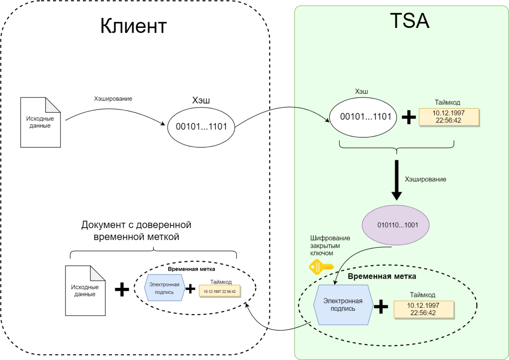

Подробнее:

* [КриптоПро: КриптоПро TSP Client](https://www.cryptopro.ru/products/pki/tsp/client)
* [КриптоПро: Задачи КриптоПро TSP](https://www.cryptopro.ru/products/pki/tsp/tasks)
* [Руниверсалис: Доверенная временная метка](https://руни.рф/Доверенная_временная_метка)
* [Контур: Метка доверенного времени в КЭП и МЧД](https://ca.kontur.ru/articles/53970-metka_doverennogo_vremeni_v_kep_i_mchd_chto_eto_i_zachem#faq-1273)
* [Клерк: Метка доверенного времени в электронной подписи. Почему она так важна](https://www.klerk.ru/blogs/astral/532034/)
* [ECM Journal: Метка доверенного времени — что это и как она поможет легитимно хранить электронные документы?](https://ecm-journal.ru/material/metka_doverennogo_vremeni_chto_ehto_i_kak_ona_pomozhet_legitimno_khranit_ehlektronnye_dokumenty)

#### Срок действия подписи с проставленной МДВ и без {#trusted-timestamp-sign-validity}

Согласно 63-ФЗ, при использовании [КЭП](#qualified), в случае отсутствия МДВ, прикреплённой к ЭП документа, подпись считается действительной, только если на **момент проверки** ЭП сертификат подписанта **действителен**.

В случае присутствия МДВ, подпись действительна, даже если сертификат истёк или был отозван. Т.к. время подписания заверено ДТС. До тех пор, пока сертификат ДТС не истечёт. Но т.к. тот выпускается сроком на 15 лет, пройдёт срок давности для хранения документа. Что имеет высокую архивную ценность.

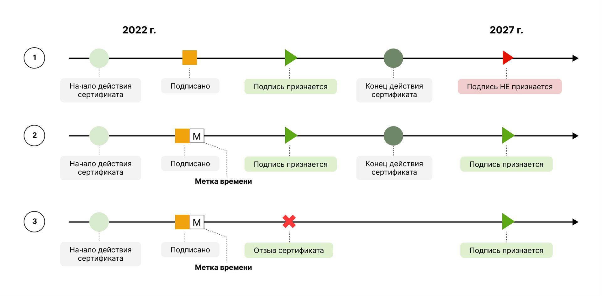

Подробнее:

* [Клерк: Метка доверенного времени в электронной подписи. Почему она так важна](https://www.klerk.ru/blogs/astral/532034/)
* [ECM Journal: Метка доверенного времени — что это и как она поможет легитимно хранить электронные документы?](https://ecm-journal.ru/material/metka_doverennogo_vremeni_chto_ehto_i_kak_ona_pomozhet_legitimno_khranit_ehlektronnye_dokumenty) (картинку взял оттуда)

## Протокол защиты транспортного уровня (TLS) {#tls}

Протокол, используемый для установки защищённого соединения в HTTPS. Позволяет установить безопасный канал связи в сети интернет, без риска раскрытия учётных данных, используемых для аутентификации или ключей, используемых для передачи защищённых данных.

TLS работает над транспортным протоколом TCP, выполняя следующие задачи:

* Шифрование &mdash; сокрытие информации, передаваемой от одного компьютера к другому.
* Аутентификация &mdash; проверка авторства передаваемой информации.
* Целостность &mdash; обнаружение подмены информации подделкой.

Для обеспечения указанных задач, используется совокупность указанных в глоссарии криптографических методик, таких как [ассиметричное шифрование](#asymmetric-encryption), [симметричное шифрование](#symmetric-encryption), [хэш-суммы](#hash)...

Протокол, расширенный применением алгоритмов по ГОСТ для защиты соединения, обычно именуется как `ГОСТ TLS`. Отличается только наличием идентификаторов, которые указывают на поддержку применения ГОСТ алгоритмов. В остальном идентичен обычному TLS.

Подробнее:

* [Skillfactory Media: TLS-протокол](https://blog.skillfactory.ru/chto-takoe-tls-i-kak-rabotaet-etot-protokol/)
* [Хабр: Что такое TLS](https://habr.com/ru/articles/258285/)
* [КриптоПро: КриптоПро TLS с ГОСТ](https://www.cryptopro.ru/products/csp/tls)
* [Веб-серверы и ГОСТ-криптография](https://www.tcinet.ru/press-centre/articles/7759/)

### Man In The Middle (человек посередине, атака посредника, MiTM) {#mitm}

Механизм, или атака (в зависимости от того, кем используется), направленная на перехват TLS соединения. Обычно, с целью получения доступа к HTTPS трафику.

Между клиентом и сервером, выполняющими обмен защищёнными сообщениями, появляется посредник. Посредник имеет доступ к трафику, передаваемому между клиентом и сервером. И имеет возможность им манипулировать. Таким образом, выдавая себя за сервер клиенту, а серверу притворяется клиентом.

При условии, что проверка подлинности сервера клиентом не производится, а сервер не требует сертификата для аутентификации пользователя, клиент считает, что подключился к требуемому ему серверу, когда на самом деле, подключился к посреднику. Затем посредник устанавливает соединение от имени клиента, но от себя, притворяясь клиентом. Тем самым получая доступ к "зашифрованным" сообщениям, т.к. клиент на самом деле шифрует сообщения для посредника, после чего посредник копирует их серверу и наоборот.

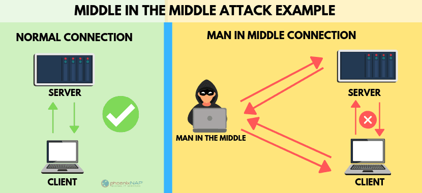

После того, как SSL научили должным образом предотвращать подобное, тем самым создав TLS, из атаки, эта методика плавно переросла в механизм, используемый некоторыми программами или ИС в легитимных целях. Например, антивирусами для сканирования зашифрованного трафика на вредоносные файлы. Или контроля просматриваемых страниц. Или даже, для блокировки рекламы (AdGuard). Что иначе с HTTPS выполнить нельзя, будучи "внешним" наблюдателем

Проверка подлинности сервера обходится с помощью установки корневого сертификата в хранилище ОС, которое большинство браузеров использует как дополнительный источник корневых сертификатов, на случай установки корпоративных сертификатов. Без установки "вредного" корневого сертификата, данная методика не будет работать на сегодняшний день. Кроме случаев, когда у сервера украли ключ от сертификата, по которому выполняется проверка его подлинности или если злоумышленнику через УЦ удастся создать сертификат, который может быть воспринят за действительный сертификат клиентом (но это пресекается Certificate Pinning).

Является одной из частых проблем, почему не удаётся установить соединение по ГОСТ TLS из корпоративных сетей. Потому что программы, реализующие механизм, не работают с ГОСТ-алгоритмами. Нет ни единой программы, известной автору, которая умела бы в применение СКЗИ для MiTM по ГОСТу... А для сайтов, требующих аутентификацию по сертификату (в ГОСТ-сфере это большое количество ИС), МiTM и вовсе не представляется возможным, т.к. у посредника не будет доступа к закрытому ключу для генерации корректного ответа на запрос сертификата. В результате чего, посредник не может поддерживать соединение и разрывает его.

<!-- FIXME -->

<!-- Подробнее:

* [Основная статья](../troubleshooting/mitm.md) -->

## HyperText Transfer Protocol (протокол передачи гипертекста, HTTP) {#http}

Базовый протокол интернета, протокол прикладного уровня, работающий на уровне приложения (над TCP и опционально, TLS). Заключается в передаче запроса в текстовом формате на сервер и получения ответа на этот запрос.

Раньше использовался исключительно для запроса веб-страниц с сервера браузерами, но затем получил применение и в других сферах.

В базовом виде выглядит так:

1.  Клиент посылает на сервер `crl.roskazna.ru` на 80-ом порту запрос следующего вида:

    ```http
    GET / HTTP/1.1
    Host: crl.roskazna.ru

    ```

2.  Сервер отвечает ему текстом следующего вида:

    ```http
    HTTP/1.1 200 OK
    Date: Tue, 14 Jan 2025 13:29:27 GMT
    Server: Apache
    Last-Modified: Thu, 31 Oct 2024 09:39:23 GMT
    ETag: "265-625c297f5d63c"
    Accept-Ranges: bytes
    Content-Length: 613
    Content-Type: text/html; charset=UTF-8

    <!DOCTYPE HTML>
    <html>
    <head>
      <meta http-equiv="Content-Type" content="text/html; charset=utf-8">
      <title>Сертификаты и Списки аннулированных сертификатов Удостоверяющего центра Федерального казначейства</title>
    </head>
    <body>
        <h1 align=center><font size=5><font color=#585C6E>Сертификаты и Списки аннулированных сертификатов Удостоверяющего центра Федерального казначейства</h1>
        <a href="/crl">/crl</a>
    </body>
    </html>
    ```

Весь обмен был выполнен с помощью команды `telnet crl.roskazna.ru 80`, можете повторить. Протокол настолько прост, что его буквально можно набирать руками...

И таким образом произошёл типичный HTTP-запрос, но в сильно упрощённом виде. Т.к. кроме заголовка `Host:` могут быть и другие. Браузер посылает гораздо больше заголовков, включая `User-Agent:`, идентифицирующий программу-клиент.

Подробнее:

* [Skillbox Media: Всё о протоколе HTTP](https://skillbox.ru/media/code/chto-takoe-http-i-zachem-on-nuzhen/)
* [MDN Web: Обзор протокола HTTP](https://developer.mozilla.org/ru/docs/Web/HTTP/Overview)
* [Хабр: Простым языком об HTTP](https://habr.com/ru/articles/215117/)
* [Руниверсалис: HTTP](https://руни.рф/HTTP)

### HyperText Transfer Protocol Secure (HTTPS) {#https}

HTTPS, это тоже самое, что и [HTTP](#http), только используемый поверх TLS соединения. Для HTTPS протокола принято по умолчанию использовать порт `443` вместо `80`. И без предварительной установки TLS-соединения, запроса не происходит.

Подробнее:

* [Selectel: В чем разница протоколов HTTP и HTTPS](https://selectel.ru/blog/http-https/)

## Датчик Случайных Чисел (ДСЧ, RNG) {#rng}

Это аппаратное или программное обеспечение, способное генерировать последовательность чисел без какого-либо видимого для наблюдателя шаблона или предсказуемости. В идеальном случае каждое следующее число в последовательности полностью непредсказуемо и не зависит от предыдущих.

В случае программного обеспечения, это чаще всего Биологический ДСЧ. Обычные программные датчики, встроенные в ОС, обычно собирают случайные числа из хаотичного пула, созданного на основе действий, выполняемых на нижнем уровне ОС, преобразованные специальным алгоритмом. Биологически ДСЧ создаёт хаотичный пул на основе непосредственных действий пользователя, таких как движения мышью или ввод на клавиатуре.

Программные датчики обычно считаются псевдослучайными, но пока было слишком мало случаев, когда злоумышленники предсказывали, какие данные эти алгоритмы выдадут.

В случае аппаратного обеспечения, это чаще всего плата расширения, вставленная в компьютер, где присутствует аппаратная реализация ДСЧ, основанная на физических процессах, которые предсказать невозможно. Аппаратные датчики не требуют пользовательского ввода, генерируют качественные случайные данные (которые даже в теории предсказать невозможно) и главное, работают быстрее БиоДСЧ.

Данные, созданные ДСЧ, используются при генерации ключей, включая временных сессионных (TLS) и для гарантированного уничтожения содержимого файла (перезаписывая его псевдослучайными данными, `cat /dev/urandom > file`).

<!-- // code: language=markdown insertSpaces=true tabSize=2 -->
